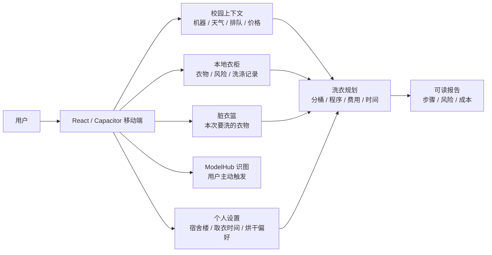

# WashMate Campus

面向校园公共洗衣场景的移动端洗护智能体。它把衣物识别、个人衣柜、宿舍洗衣机状态、天气与晾晒条件、洗衣分桶、费用时间估算和报告生成串成一个完整流程：用户只需要维护自己的衣柜和宿舍楼，就能知道今天要不要洗、怎么洗、去哪洗、要花多少钱、多久能取。

当前主界面是 `frontend/` 下的 React + TypeScript + Capacitor 移动端应用；`backend/` 是 Python 参考实现和测试 oracle。移动端核心业务已经内置为 TypeScript 服务，普通衣柜、脏衣篮、机器状态、方案和报告流程不需要单独启动本地后端。

## Highlights

- 移动端完整闭环：今日建议、脏衣篮、衣柜、添加衣物、洗衣房、机器详情、方案详情、报告和个人设置。
- 衣物智能识别：支持手动录入、图片识别、批量识别和文字识别；ModelHub 只在用户主动触发识图时调用。
- 校园机器上下文：支持 CleverSchool 与海乐生活来源，统一楼名、机器类型、状态、剩余时间和排队估计。
- 确定性洗衣规划：按材质、颜色、洗护禁忌、床品、手洗/干洗、烘干风险和用户约束拆分批次。
- 结构化报告：输出洗衣步骤、费用时间、机器环境、风险提醒、节水节电说明，前端无需从自然语言反向解析。
- 工程化交付：Python unittest、Vitest、Vite build、Capacitor sync、Android APK 构建和 GitHub Actions 发布链路齐全。
- 安全边界明确：不把 API key、keystore、`.env` 或真实凭据写进源码；缺失数据显式报错或显示状态，不静默猜测。

## Tech Stack

| Layer | Stack | Role |
| --- | --- | --- |
| Mobile UI | React 18, TypeScript, Vite | 手机端交互界面与本地状态 |
| APK shell | Capacitor 7, Android Gradle | Android 打包与 WebView 容器 |
| In-APK services | TypeScript modules in `frontend/src/api/` | 衣柜、校园上下文、洗衣规划、报告生成 |
| Reference backend | Python 3.12, dataclasses, unittest | 模块化参考实现与测试 oracle |
| External services | ModelHub/Gemini v1beta, CleverSchool, Haier, Open-Meteo | 识图、宿舍机器状态、天气 |
| Tooling | uv, npm, GitHub Actions | 依赖、测试、构建和发布 |

## Product Flow



移动端在 APK 内执行主要业务逻辑。只有三类行为会访问外部服务：

- 用户保存宿舍楼后读取校园洗衣机/烘干机状态。
- 天气模块读取清华附近天气。
- 用户点击识图或文字识别时，把图片或文本发送到用户配置的 ModelHub endpoint。

## Repository Layout

```text
Wash-agent/
  README.md
  AGENTS.md
  pyproject.toml
  app.py                         # legacy Streamlit entry, not primary UI
  main.py                        # minimal CLI entry
  backend/
    shared/models.py             # Python shared dataclasses and enums
    clothing_extraction/          # ModelHub client, prompt, clothing profile extraction
    wardrobe/                     # wardrobe CRUD and frequency advice
    campus/                       # machine APIs, campus context, weather
    laundry/                      # deterministic laundry planner
    reports/                      # user-facing report generator
  frontend/
    src/
      App.tsx
      api/                        # in-APK TypeScript services
      components/                 # reusable mobile UI shell
      screens/                    # Today / Wardrobe / Laundry Room / Report / Profile
      data/                       # packaged product content and demo fixtures
    android/                      # Capacitor Android project
    package.json
    capacitor.config.ts
  config/
    api_config.example.json       # Python-side ModelHub config template
    machine_rules.json            # prices, modes, drying rules, type mapping
  data/
    wardrobe_sample.json
    machines_mock.json
    pics/
  docs/
    structure_design.md
    c_delivery.md
    e_demo_script.md
  tests/
    test_*                        # Python unit and integration tests
  .github/workflows/
    preview.yml
    release-apk.yml
```

## Core Modules

| Module | Main files | Responsibility |
| --- | --- | --- |
| Mobile orchestration | `frontend/src/api/mobileSummary.ts` | 组合衣柜、天气、机器、频率建议、洗衣方案和报告 |
| Mobile screens | `frontend/src/screens/` | 手机端页面、表单、状态、空态、错误态 |
| ModelHub config | `frontend/src/api/modelHubConfig.ts` | 保存/清除本机识图配置，限制模型名 |
| Recognition | `frontend/src/api/modelHubRecognition.ts` | 图片识别、文字识别、JSON schema 约束输出 |
| Campus API | `frontend/src/api/campusMachineApi.ts`, `backend/campus/` | CleverSchool/海乐机器状态、楼名归一、排队估计 |
| Wardrobe | `frontend/src/api/mobileSummary.ts`, `backend/wardrobe/` | 本地衣柜、脏衣篮、穿着/洗涤记录、频率建议 |
| Planner | `frontend/src/api/laundryPlanner.ts`, `backend/laundry/planner.py` | 洗衣分桶、程序选择、费用时间、全局提醒 |
| Report | `frontend/src/api/reportGenerator.ts`, `backend/reports/generator.py` | 结构化报告与用户可读说明 |
| Contracts | `frontend/src/api/types.ts`, `backend/shared/models.py` | TypeScript/Python 数据契约 |

## Quick Start

### Prerequisites

- Python 3.12
- uv
- Node.js 22 and npm
- Android APK 构建额外需要 JDK 21、Android SDK 35、Android Build Tools 35.0.0

### Install and Run Mobile Preview

```powershell
uv sync
cd frontend
npm install
npm run dev
```

打开 Vite 输出的本地地址即可预览。移动端摘要、衣柜、方案、报告和大部分交互都在前端本地服务中运行，不需要另起 HTTP 后端。

### Common Verification

```powershell
uv run python -m unittest discover -v
cd frontend
npm test
npm run build
npm run cap:sync
```

`npm run cap:sync` 会先执行前端 build，再同步 Capacitor Android 项目。

### Build Debug APK

先确认本机具备：

- JDK 21
- Android SDK platform `android-35`
- Android Build Tools `35.0.0`
- `frontend/android/local.properties` 中配置 `sdk.dir=<your Android SDK path>`

然后执行：

```powershell
cd frontend
npm run apk:debug
```

生成文件：

```text
frontend/android/app/build/outputs/apk/debug/app-debug.apk
```

## ModelHub and Secrets

### Mobile app recognition config

移动端识图配置在“我的”页面填写：

```text
ModelHub baseUrl: https://modelhub.ailemac.com/v1beta
apikey: sk-your-api-key-here
model_name: gemini-3.1-pro-preview
```

当前代码会把配置保存到本机 `localStorage`，用于下次打开继续识图；页面提供“清除”入口。识图请求只在用户主动点击图片识别、批量识别或文字识别时发出，二进制图片不会自动上传。

### Python reference config

Python 参考实现使用本地配置文件：

```powershell
Copy-Item config/api_config.example.json config/api_config.json
```

`config/api_config.json` 已在 `.gitignore` 中忽略。不要把真实 `apikey`、`.env`、keystore 或签名密码提交到仓库。

## Development Commands

| Task | Command |
| --- | --- |
| Sync Python env | `uv sync` |
| Run all Python tests | `uv run python -m unittest discover -v` |
| Run C module demo | `uv run python scripts/demo_c_module.py` |
| Install frontend deps | `cd frontend; npm install` |
| Start Vite dev server | `cd frontend; npm run dev` |
| Run frontend tests | `cd frontend; npm test` |
| Build frontend | `cd frontend; npm run build` |
| Sync Capacitor Android | `cd frontend; npm run cap:sync` |
| Build debug APK | `cd frontend; npm run apk:debug` |

## CI and Release

`preview` branch and pull requests to `preview` / `main` run:

- `uv run python -m unittest discover -v`
- `npm ci`
- `npm test -- --run`
- `npm run build`

`main` branch push additionally:

- reads release version from `frontend/package.json`
- updates Android `versionCode` and `versionName`
- installs JDK 21 and Android SDK 35
- runs `npm run cap:sync`
- builds signed release APK
- uploads `app-release.apk`
- publishes a GitHub Release

Stable release signing should use GitHub Secrets:

```text
ANDROID_KEYSTORE_BASE64
ANDROID_KEYSTORE_PASSWORD
ANDROID_KEY_ALIAS
ANDROID_KEY_PASSWORD
```

If these secrets are absent, the workflow creates a CI-only temporary keystore so the APK can still be built. That artifact is installable, but not suitable for long-term update continuity because the signing key is not stable.

## Data and Configuration Rules

- `config/machine_rules.json` is the source of truth for prices, modes, durations, provider program labels and drying context.
- Machine capacity is not part of the current D/E contract and should not be invented in UI or planning logic.
- Missing price, duration, machine state, weather or ModelHub output should become an explicit error/status, not a guessed fallback.
- Frontend displays user-facing names and labels; provider ids, `towerKey`, `positionId`, raw `machine_type` keys and rule keys stay inside API/config layers.
- `frontend/src/api/types.ts` mirrors mobile contracts; `backend/shared/models.py` is the Python shared contract layer.

## Testing Scope

The project already includes tests for:

- clothing extraction and ModelHub failure boundaries
- wardrobe CRUD and frequency advice
- campus tower merging, machine parsing and queue estimation
- laundry planning constraints, bucket splitting, pricing and wait warnings
- report generation
- full Python integration flow
- mobile pages, local service integration, ModelHub config persistence/clear, dirty basket, machine detail and report rendering

Recommended pre-delivery gate:

```powershell
uv run python -m unittest discover -v
cd frontend
npm test
npm run build
npm run cap:sync
```

APK delivery additionally requires:

```powershell
cd frontend
npm run apk:debug
```

## Architecture Principles

- Keep page code as orchestration only; do not put prompts, parser details, storage internals or planning rules into screens.
- Reuse existing contracts and helpers before adding new models or parallel implementations.
- Pass cross-module data through explicit dataclasses/types, not ad hoc dictionaries.
- Prefer explicit errors and visible UI states over fallback/default logic.
- Update `docs/structure_design.md` when module boundaries, public interfaces or main workflow change.
- Use `uv` for Python dependency and command execution work; do not introduce a separate requirements workflow unless explicitly requested.

## Project Status

The repository is structured as a final course project with a mobile-first product surface and a modular reference backend. The stable user-facing entry is the React/Capacitor app in `frontend/`; `app.py` remains a legacy placeholder and `main.py` is only a minimal CLI stub.
